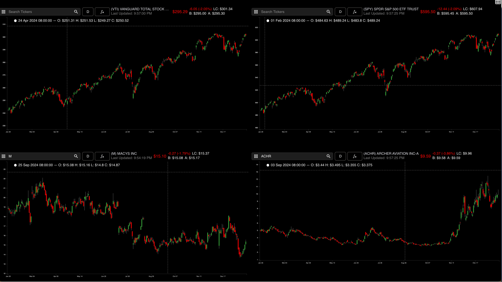
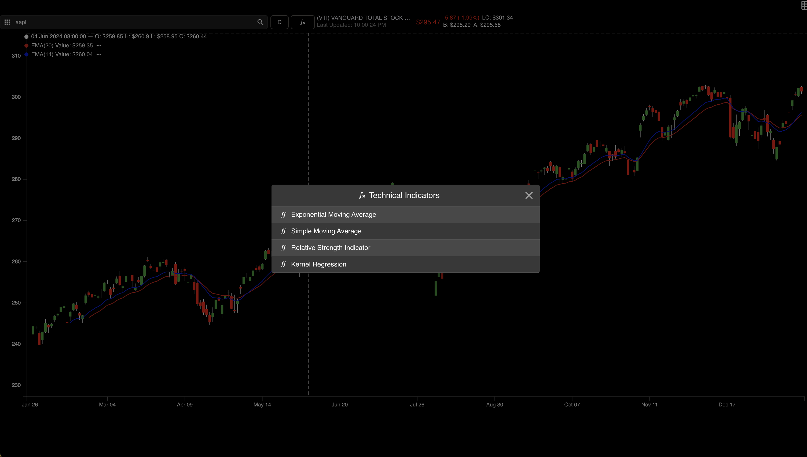
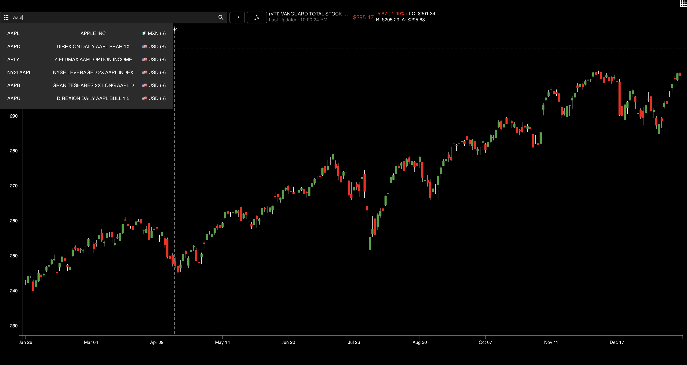
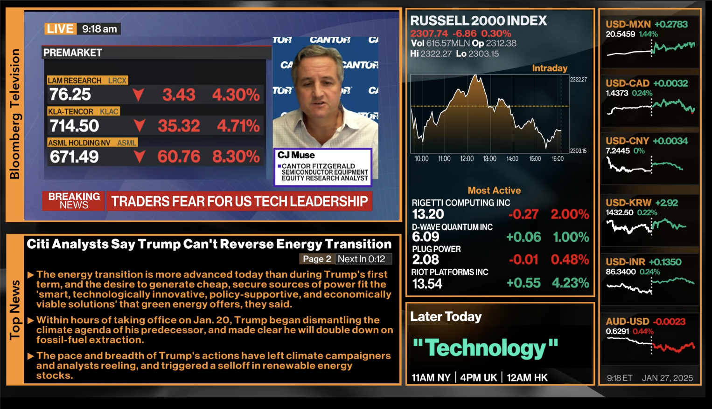

# ibkr-charts

This project aims to provide a tempalte UI that allows users to chart on IBKR datastreams. It is by no means finished, and will be undergoing constant improvements! 

This project also features the following functionalities:  
- Live data, together with updated candlestick charting.
- Pre-written indicators that are coded from scratch in Typescript, and can be added on to in the code.
- Multi-charting functionalities, up to 6 charts per screen (you can open multiple tabs). 
- In the home page, a built in Bloomberg news stream.
- Ticker search functionalities on IBKR offerings.

|  |  |
|---------------------------|---------------------------|
|  |  |

## 🚀 Quick Start

1. Install frontend dependencies
```bash
cd frontend
yarn install # or whatever package manager
```
2. Install backend dependencies
```bash
conda activate my_env # or whatever virtual environment you are using
cd backend
pip install -e .
```
3. Set up environment variables
In `.env` under `backend/`, add in your mongodb path. This will be the path the tickers are read from. You can find the data for this in my public drive [here](https://drive.google.com/drive/folders/13Zlw5Qyg09iLu4SJTExVvpv1sw-pRmVo)
```
# Database name should be 'finflow'
# Collection name should be 'all_tickers'
# Alternatively, edit the parameters in `backend/src/backend/app/api/clients/ibkr/search.py`
MONGODB_URI="..."
```
In `.env` under `frontend/`
```
REACT_APP_BASE_URL="http://localhost:1245/"
REACT_APP_WEBSOCKET_URL="ws://localhost:1245"
```
4. Spin up and login to your TWS workstation. Port should be running on `7497`.
5. Spin up frontend and backend 
```bash
cd backend && uvicorn backend.app.main:app --reload --port 1245
cd frontend && yarn start
```

And you should be good to go.

## Routes
At the moment, only the following routes are available
```bash
/ # For home bloomberg video feed
/charting # For custom charting
```